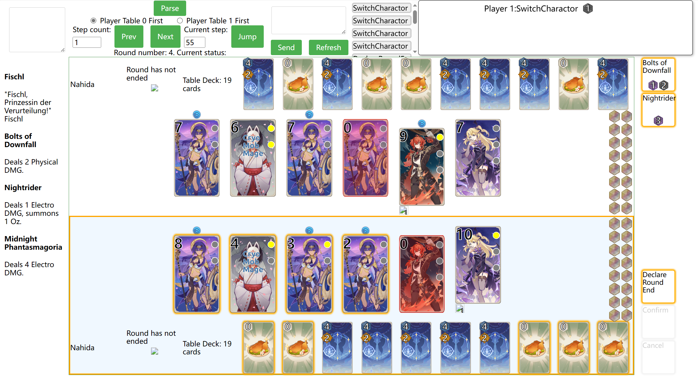

# GITCG-frontend

> Simple frontend for zyr17/GITCG

## resorces downloading

We do not provide any images here, you should collect them by your self before
using this project.  in `collector`, we give a way to collect images.

## usage

run in development mode as Commands section.

Top left text box is used to put JSONL logs from zyr17/GITCG and show the data.
If `/log.txt` exists, it will automatically read it. Otherwise, input data
and click Parse.

When log is loaded, use prev \& next to show previous or next log data and
can set step count or jump to specific step. Switch between player 0 first or
player 1 first will decide who on top and who on bottom. By default, player 0
is on top. Current active player is marked with gold border. Click on any
elements will print its corresponding data in console.

To interact with GITCG, first open FastAPI server
on GITCG, then click refresh to receive current state. When requests is needed,
they will be shown on top-right. hover on a request will show the detail
of the request.
Text box in the middle is used to input command, type command and press enter
or click send to send command to server. If command is not valid or bug occurs,
error message may be shown in console, server-side output, or 
raise exception on server side. If command is valid, it will be sent to server,
update states, clear the command box, print all successfully sent command lists
in console. When receive state with any method from server, if the state is
different from the last state recoreded, it will append to the logs, and can
be checked by prev \& next.

You can paste multiple command lines in the command box and click send, 
commands will be send to server one by one, and with 1 second delay between
each command.

For the detail of commands, please refer to 
`agents/interaction_agent.py` in zyr17/GITCG.



## Commands

You can replace `yarn` with `npm run` here.

```bash
# build for production
yarn build
yarn winbuild

# development mode
yarn dev
yarn windev

# run unit tests
yarn test

# serve the bundled dist folder in production mode
yarn serve
```
