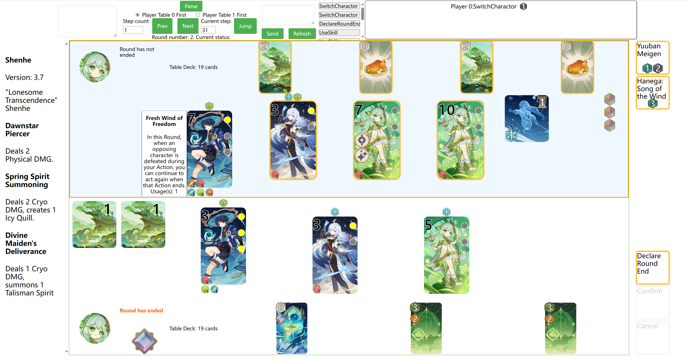

# LPSim-frontend

> Simple frontend for [LPSim](https://github.com/LPSim/backend).

[Github.io](https://lpsim.github.io/frontend/) Update when new commits is push
to the master, sometimes may have trouble loading.

[Self hosted page](https://lpsim.zyr17.cn/) Update manually, usually more stable but may not be latest version. Server on China.

## Disclaimer

This project is for learning and communication only. Code of this project is open-sourced with APGLv3 license. This project IS NOT affiliated with miHoYo. All game text and image materials are owned by miHoYo. This project and its repositories DO NOT contain any materials owned by miHoYo.

## usage

### replay

run in development mode as Commands section.

Top left text box is used to put JSONL logs from LPSim/backend and show the data.
If `/log.txt` exists, it will automatically read it. Otherwise, input data
and click Parse.

When log is loaded, use prev \& next to show previous or next log data and
can set step count or jump to specific step. Switch between player 0 first or
player 1 first will decide who on top and who on bottom. By default, player 0
is on top. Current active player is marked with gold border. Click on any
elements will print its corresponding data in console.

# command-line interaction

To interact with LPSim, first open FastAPI server
on LPSim, then click refresh to receive current state. When requests is needed,
they will be shown on top-right. hover on a request will show the detail
of the request.
Text box in the middle is used to input command, type command and press enter
or click send to send command to server. If command is not valid or bug occurs,
error message may be shown in console, server-side output, or 
raise exception on server side. If command is valid, it will be sent to server,
update states, clear the command box, print all successfully sent command lists
in console. When receive state with any method from server, if the state is
different from the last state recoreded, it will append to the logs, and can
be checked by prev \& next.

You can paste multiple command lines or array of two command arrays for two
players in the command box, and click send to perform automatic interaction.
For detail of automatic interaction, please refer to codes in App.vue.

For the detail of commands, please refer to 
`agents/interaction_agent.py` in LPSim/backend.

### GUI interaction

To interact with GUI, first open FastAPI server on LPSim, then click refresh
to receive current state. When requests is needed, available requests and 
objects will be marked with gold border. To perform elemental tuning, skill,
or decleare round end, click corresponding buttons on right. To switch 
charactor, click charactor that want switch to. To use card, click card first,
then if this card need a target, click target. When an action need cost, the
code will automatically select the cost. You can manually select cost by 
clicking dice. When action, target and cost is selected, click confirm to send
command. If mistakenly selected, click cancel to cancel the selection. You can
also use space/enter to confirm and esc to cancel. 

When clicking on card, skill, charactor, summon, support, the detail 
information will be shown on the left, and also print in the console for its
structure. Hover on team status or charactor status will show its information
beside the icon.




## Commands

You can replace `yarn` with `npm run` here.

```bash
# build for production
yarn build
yarn winbuild

# development mode
yarn dev
yarn windev

# run unit tests
yarn test

# serve the bundled dist folder in production mode
yarn serve
```
